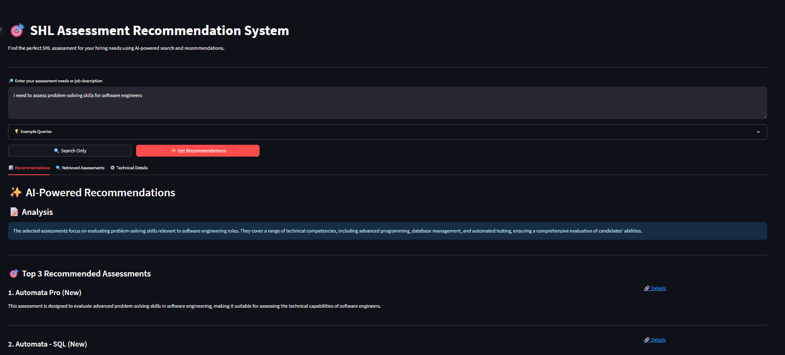
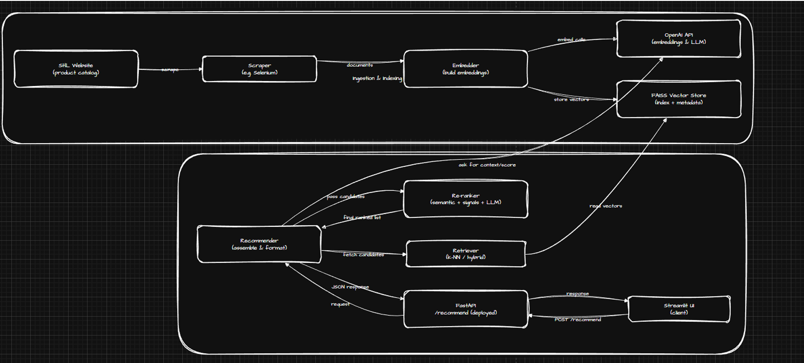

# RAG-based Retrieval — SHL Product Catalog

🔗 **Live Demo:** [Streamlit App](https://shlassement-s2vdfjulxngmqeaapjsmfx.streamlit.app/)


> Single-file README for the repository. Includes project summary, repository file structure, development workflow (dense → sparse → hybrid), evaluation metrics, runbook, and quick notes about the web-scraping challenges you mentioned.

---

## Project summary

This repo implements a Retrieval-Augmented Generation (RAG) system over the SHL product catalog. It contains the full pipeline from web scraping to evaluation and light UI. The goal is a clear, reproducible pipeline you can iterate on.

Key parts:

* Scraper: BeautifulSoup pages → cleaned documents with metadata.
* Embeddings: Dense vectors stored in FAISS (cosine similarity).
* Sparse: BM25 index for lexical matching.
* Retrieval: You experimented with dense-only, sparse-only, then combined hybrid retrieval using `alpha=0.7`.
* Reranking: OpenAI chat model used to re-rank and produce final recommendations (used for evaluation; LLM re-ranking is the measured latency bottleneck).
* Evaluation: RAG-as-method evaluation with Top-k, MRR, nDCG and latency measurements.

---

## Repository file structure (reflects your screenshot)

<p align="center">
  
  <br/>
  <em>Figure 1 — Project folder structure (backend/services, data, docker, etc.)</em>
</p>

---

<p align="center">
  
  <br/>
  <em>Figure 2 — Architecture Digram for this Project</em>
</p>


```
SHL_RAG/
├─ backend/
│  ├─ routers/
│  │  └─ recommendation.py
│  ├─ services/
│  │  ├─ chat.py
│  │  ├─ combine_res.py
│  │  ├─ embedder.py
│  │  ├─ eval.py
│  │  ├─ individual_test.py
│  │  ├─ re_ranker.py
│  │  ├─ retriever.py
│  │  ├─ scraper.py
│  │  ├─ config.py
│  │  └─ main.py
│  └─ __pycache__/
├─ data/
│  ├─ eval_results/
│  │  ├─ eval_17625030205.csv
│  │  ├─ eval_1762503657.csv
│  │  └─ eval_rag_1762514155.csv
│  ├─ vector_store/
│  ├─ individual_solutions.csv
│  ├─ individual_solutions.json
│  ├─ prepackaged_solutions.csv
│  ├─ prepackaged_solutions.json
│  ├─ shl_all_assessments.csv
│  └─ shl_all_assessments.json
├─ docker/
│  └─ shl_rag
├─ .env
├─ .gitignore
├─ requirements.txt
└─ streamlit.py
```

---

## Development workflow & notes (what you did and recommended sequence)

You mentioned web scraping was the most difficult part. That’s common — pages vary in HTML structure, dynamic content, and inconsistent markup. The approach that worked best for you (and is recommended for reproducible development) is:

1. **Start with Dense-only retrieval**

   * Build embeddings for all cleaned documents.
   * Insert into FAISS and validate basic nearest-neighbour searches on simple queries.
   * Use this to quickly catch indexing/tokenization errors and embedding issues.

2. **Sparse-only (BM25) baseline**

   * Build a BM25 index on the same cleaned documents.
   * Run lexical queries to validate term matching and passage scoring.
   * Use sparse results to understand where your dense model misses exact-term matches.

3. **Combined Hybrid retrieval (Dense + Sparse)**

   * Implement hybrid scoring: `score = alpha * cosine_dense + (1-alpha) * normalized_bm25`.
   * Tune `alpha` (you used `0.7`) using dev queries and evaluate Top-1/Top-3/MRR.
   * Compare hybrid to dense-only and sparse-only to justify the choice.

4. **Reranker / LLM step (for evaluation / final ranking)**

   * Use a concise prompt that receives only top-K candidate snippets. Keep the context short to reduce token costs and latency.
   * Use the LLM as an evaluator / re-ranker — not as the primary retrieval layer.

5. **Evaluation**

   * Keep a held-out test set of real queries mapped to canonical product IDs.
   * Compute Top-1, Top-3, Top-5, MRR, nDCG, Precision@k (note: single ground-truth will lower Precision@k), Recall@k, and retrieval + LLM latencies separately.

---

##  evaluation metrics (as provided)


* Recall@10: 0.45
* Avg retrieval time: 1.7 s
* Avg LLM time: 6.0 s
---


