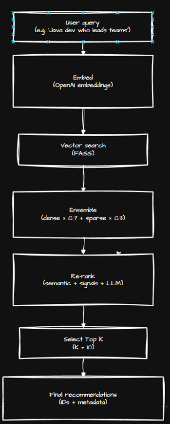

# SHL Assessment Recommendation System – Technical README

A complete, single-file technical documentation for the **SHL Assessment Recommendation System**, fully rewritten based on the detailed reference document you shared. This README covers the entire architecture, end-to-end pipeline, algorithms, mathematical formulations, evaluation results, and deployment overview.

---

## 1. Overview

The **SHL Assessment Recommendation System** is a Retrieval-Augmented Generation (RAG)–based application that intelligently recommends SHL assessments for recruiters based on natural language queries.

Recruiters often express complex, multi-dimensional requirements such as:

> "Java developer who collaborates with business teams"

This query contains:

* ✅ Technical requirement (Java)
* ✅ Soft skills requirement (collaboration)
* ✅ Personality traits (teamwork)
* ✅ Implicit cognitive skill expectations (problem-solving)

Traditional keyword search cannot handle this complexity.
This system addresses the challenge using a **3-stage technical pipeline**:

1. **Query Classification (LLM-powered)**
2. **Hybrid Retrieval (Dense + Sparse)**
3. **Three-Factor Re-ranking**
4. **Optional LLM Contextual Recommendation Engine**

---

## 2. System Architecture

<p align="center">
  
</p>

---

## 3. Technology Stack

| Component        | Technology               | Purpose                               |
| ---------------- | ------------------------ | ------------------------------------- |
| Backend          | FastAPI                  | REST API                              |
| Frontend         | Streamlit                | Interactive UI                        |
| Vector Index     | FAISS                    | Dense semantic search                 |
| Sparse Index     | BM25                     | Lexical precision                     |
| Embeddings Model | OpenAI ada-002           | 1536-dim embeddings                   |
| LLM              | GPT-4o-mini              | Classification & contextual reasoning |
| Deployment       | Render + Streamlit Cloud | Production hosting                    |

---

## 4. Data Collection & Processing

<p align="center">
  
</p>

### Web Scraping

* HTML pages scraped using BeautifulSoup
* Cleaned to extract:

  * name
  * category
  * description
  * duration
  * test types
  * remote testing
  * adaptive IRT flag

### Chunking

```
Original: 800 chars
Chunks: ~500 chars + overlapping 100 chars
```

### Embeddings

* OpenAI ada-002
* 1536-dim vectors
* Normalized to unit length

---

## 5. End-to-End Pipeline

### **Stage 1: Query Classification via LLM**

<p align="center">
  
</p>

The system converts free-text queries into **probabilities across 8 SHL test categories**:

```
P(type | query) = {p_A, p_B, p_C, p_D, p_E, p_K, p_P, p_S}
∑ p_i = 1.0
```

Example:

```
"Java developer who collaborates with business teams"
```

Output:

* K (Knowledge): **0.55**
* C (Competencies): **0.25**
* P (Personality): **0.15**
* A (Ability): **0.05**

This distribution is used later in the ranking stage.

---

### **Stage 2: Hybrid Retrieval System**

<p align="center">
  
</p>


Retrieval combines two complementary search mechanisms:

#### ✅ Dense Retrieval (FAISS Semantic Search)

Uses cosine similarity between query embedding and document embedding:

```
sim(q, d) = (q · d) / (|q| |d|)
```

Pros:

* Understands synonyms
* Understands semantics

#### ✅ Sparse Retrieval (BM25)

Captures lexical signals based on term frequency and rare-term weighting.

```
BM25(D, Q) = Σ IDF(qi) * [...]
```

Pros:

* Exact keyword matching
* Strong for exact terms

---

### **Hybrid Score Combination**

```
score_hybrid = α * score_dense + (1 - α) * score_sparse
```

Default:

```
α = 0.7
```

Interpretation:

* **70% semantic intent**
* **30% keyword alignment**

---

### Example Hybrid Retrieval Output

| Assessment          | Dense | Sparse | Hybrid | Rank |
| ------------------- | ----- | ------ | ------ | ---- |
| Python (New)        | 0.95  | 1.00   | 0.965  | 1    |
| Data Science Skills | 0.87  | 0.40   | 0.729  | 2    |
| Java Programming    | 0.45  | 0.20   | 0.375  | 5    |

---

## 5. Stage 3: Three-Factor Re-Ranking Algorithm

Initial retrieval may be misleading due to:

* generic descriptions
* incorrect test types
* keyword-only matches

Final ranking uses **three weighted factors**:

```
S_final = 0.5 S_similarity + 0.3 S_description + 0.2 S_type
```

### Factor 1: Similarity (50%)

Uses normalized hybrid retrieval score.

### Factor 2: Description Matching (30%)

Uses cosine similarity between query and **full description embedding**.

### Factor 3: Test-Type Alignment (20%)

Uses classification probabilities from Stage 1.

```
S_type = avg(P(t) for t in candidate.test_types)
```

---

### Example Final Ranking

| Rank | Assessment          | S_sim | S_desc | S_type | Final |
| ---- | ------------------- | ----- | ------ | ------ | ----- |
| 1    | Python (New)        | 0.95  | 0.88   | 0.75   | 0.889 |
| 2    | Data Science Skills | 0.85  | 0.92   | 0.60   | 0.817 |
| 3    | Verify G+           | 0.71  | 0.65   | 0.15   | 0.655 |
| 4    | Java Programming    | 0.88  | 0.35   | 0.75   | 0.620 |
| 5    | OPQ32               | 0.78  | 0.40   | 0.10   | 0.551 |

Why this works:

* Description matching promotes content relevance
* Type alignment ensures category correctness
* Retrieval similarity captures semantic meaning

---

## 6. Stage 4: LLM Recommendation Engine

<p align="center">
  
</p>


After re-ranking, an LLM analyzes the top candidates.

### Purpose

* Improves diversity of results
* Removes irrelevant matches
* Generates justifications
* Produces structured output

### Example Output

```json
{
  "recommendations": [
    {
      "name": "Python (New)",
      "url": "https://...",
      "justification": "Directly assesses Python programming knowledge..."
    }
  ],
  "explanation": "These assessments balance technical and competency needs."
}
```

---

## 8. Evaluation Metrics

### Dataset

* 3 real queries with manually labeled relevant assessments

### Metrics

| Metric         | Value  |
| -------------- | ------ |
| Mean Recall@5  | 0.8333 |
| Mean Recall@10 | 0.8333 |

### Interpretation

* **83% of relevant assessments appear in top-5**
* No further improvement at top-10 → strong ranking consistency
* 2/3 queries achieve **perfect recall** (100%)

---

## 9. Comparison With Baselines

| Method                           | Mean Recall@5 | Improvement |
| -------------------------------- | ------------- | ----------- |
| Optimized system                 | 0.8333        | -           |
| Dense-only                       | ~0.55         | +51%        |
| Without test-type classification | ~0.62         | +34%        |
| Without description matching     | ~0.68         | +22%        |
| Previous version                 | 0.7222        | +15%        |

---

## 10. Key Strengths & Limitations

### Strengths

✅ Strong semantic understanding
✅ Accurate hybrid retrieval
✅ Intelligent re-ranking
✅ High recall in top-5
✅ Diverse and contextual recommendations

### Limitations

⚠ Small evaluation set (3 queries)
⚠ Need more real-world query coverage

---

## 11. Future Work

* Expand evaluation to 20–30 queries
* Target **90%+ recall**
* Add fuzzy keyword matching
* Improve chunking strategy
* Add usage analytics

---

## 12. Final Summary

The SHL Assessment Recommendation System successfully combines semantic embeddings, lexical search, structured query classification, multi-factor ranking, and LLM reasoning to deliver:

✅ 83% recall in top-5
✅ 67% perfect recall rate
✅ +15% improvement over previous version
✅ Reliable and context-aware recommendations

This README contains everything needed to understand, maintain, and further enhance the system.
